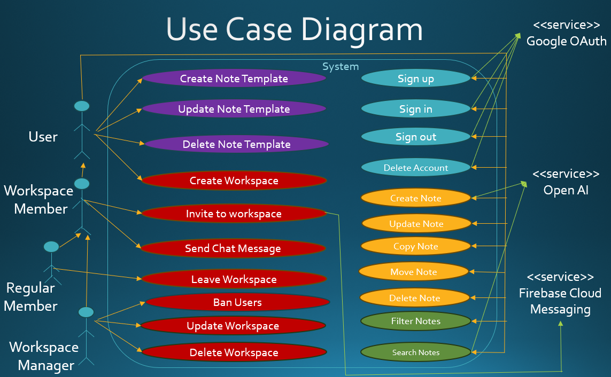
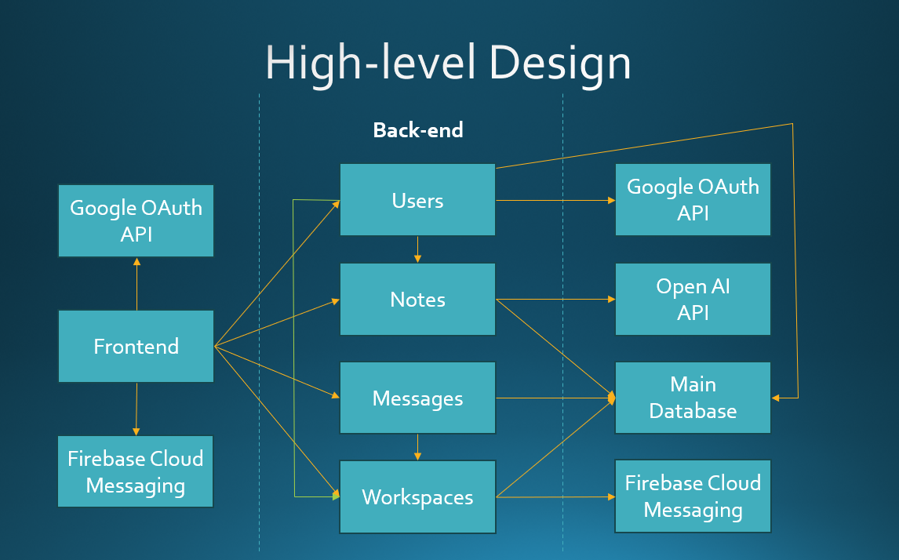

# Requirements and Design


## 1. Change History


| **Change Date**   | **Modified Sections** | **Rationale** |
| ----------------- | --------------------- | ------------- |
| 01.10.2025 | 3.3, 4.2, 4.3 | Removed all speech-to-text references. Made the Vector DB non-optional. This is because the documentation has to be consistent and optional features are not a valid basis for requirements |
| 14.10.2025 | 3.3, 4.2, 4.3 | Vector Database has been removed, we will maintain only one database. This is because an entire database dedicated to vectors is unnecessary and overly complicated for the scope and scale of our project |
| 14.10.2025 | 3.3, 4.2, 4.3 | Templates will work by created a template note and copying the note over to other workspaces. This was done to simplify implementation and for clarity |
| 20.10.2025 | 3.3, 4.2, 4.3 | Adding a user to a workspace will now send a push notification. Chat messages will no longer send a push notification|
| 24.10.2025 | 4.1 | Removed Template as a backend component since it's no longer a component. Added component interfaces |
| 25.10.2025 | 4.4 | Add more frameworks and libraries used during implementation |
| 25.10.2025 | All | Cleaned up doc and implemented feedback from M2 |
| 26.10.2025 | 4.6 | Added sequence diagrams for components |
| 10.11.2025 | 3.5, 3.7 | Revised the formal use case specifications to the state of the app in M4. This is to provide a reference for testing
| 27.11.2025 | 3.* | Revised the entire requirement specification. This is first to resolve the dilema the croup had between copying notes and creating from template - now bothoptions are available. Create from template allows to create a note from template, Copy copies template as template and notes as notes. Secondly, since we do not want workspace manager to leave the workspace, we had to create two more actors for workspace member and workspace regular member and rework the inheritance between them. Formal use case specification changed so that every use case has separate error handling for client-side (user) errors, and server-side issues. A lot of consistency changes as well.
---


## 2. Project Description


In short, we are aiming to create an application that would allow
users to store all their (non-sensitive) information in one place and in a way that is easy to update, access and search. The app itself would not incorporate dedicated features such as notes, todo-lists etc. Instead one would be able to store information in a general note, which would be composed of numerous input fields: text, datetime etc. Users will be able to create templates for their own formats of notes and join workspaces where they can create notes that will be shared with other users.
The target audience is the general public. If one has a large amount of different kinds of notes, todos etc., they can use this app as a "general memory system" providing them one place to retrieve and update their entire collection of notes. However, we are especially aiming for groups of people who want to collaborate on their goal and manage this collaboration in one place and in a very customised manner. Existing apps do not fully provide such functionality (Notion: missing todos/notifications/chat, WhatsApp: files stored on everyone's machines, not able to see history prior to joining the communities, Discord: file sharing limit, Facebook: membership limits)


## 3. Requirements Specification


### **3.1. List of Features**
1. **[Manage Notes]**: A user can create, update, read, copy and delete their own notes as well as move them to other workspaces for other people to see
2. **[Retrieve Notes]**: A user can search through their notes and filter through the notes they see by their tags. The searching will be semantic, which means cases when the user does not type exactly the content of the note would be handled and the note will still be displayed.
3. **[Collaborate]**: A User can create workspaces in which case they become their managers. Inside a workspace, notes can be posted and an associated chat can be used. The owner is able to invite people to the workspace by an email address, and a push notification will be sent to those invited notifying them. Notes in the workspace are visible to all Users who accepted the invitation. Naturally, the manager can update their workspace, or even delete it, as well as ban certain users.
4. **[Customize Format]**: Users would be able create and manage their own formats of notes, known as templates. These can include any combination of text, signature and date fields, with the condition of at least one field, one tag and a title. They are then able to use the templates to make notes with a pre-created layout of fields.


### **3.2. Use Case Diagram**



### **3.3. Actors Description**
1. **[User]**: The general user of the application. Can fully manage (CRUD + search + template creation) their own notes. Can join and create workspaces.
2. **[Workspace Member]** - can contribute to workspaces they are in by sending notes and chat messages, as well as inviting new members.
3. **[Regular Member]** - inherits from Workspace Member. Can leave workspace.
4. **[Workspace Manager]**: Inherits from Workspace Member. Has additional options to update and delete the workspaces they own. Can also ban users from their workspace(s).
5. **[Google OAuth API]**: External service used for authentication.
6. **[Open AI API]**: The role of the API would be to create vector embeddings for notes and search queries so that vector-based search algorithms, such as KNN, can be used. This is to enhance the search quality so that the user does not have to exactly match the text of the note in their prompt.
7. **[Firebase Cloud Messaging]**: Firebase handles the logic for sending push notifications. 


### **3.4. Use Case Description**
- Use cases for feature 1: Manage Notes
1. **Create Note**: The user can create notes by filling in a chosen note template, adding or removing fields if necessary. They can then store this note in a chosen workspace.
2. **Update Note**: Users can update their notes and change the title, description, and other data. 
3. **Move Note**: Users can move a note to a selected workspace.
4. **Delete Note**: Users can delete a selected note.
5. **Copy Note**: Users can copy a note to a selected workspace, creating a clone of it in the target workspace and keeping the original one in the original workspace.


- Use cases for feature 2: Retrieve Notes
6. **Search Notes**: A user can search for notes matching a given prompt, and is provided with a list of notes in order of similarity (top results will be notes that most match the query).
7. **Filter Notes**: After retrieving search results, a user can filter the results by certain tags and creation/last edit dates. 


- Use cases for feature 3: Collaborate
8. **Create Workspace**: A user can create a workspace and become the manager of it.
9. **Join Workspace**: A user can join the workspace if they are invited.
10. **Invite to Workspace**: Any user that is part of a workspace can invite other users to the workspace. The invited user will be sent a push notification.
11. **Send Chat Message**: A user can send chat messages to other users or the workspaces that they are part of. A chat message will appear on chat screens of other users in the workspace without a need to refresh.
12. **Update Workspace**: The workspace manager can update workspace metadata, like title, descriptions, etc. 
13. **Leave Workspace**: A user can leave any workspace that they are part of.
14. **Delete Workspace**: The workspace manager can delete the workspace and all associated data.
15. **Ban users**: The workspace manager can ban a user, kicking them out and preventing them from joining in the future. 


- Use cases for feature 4: Customize Format
16. **Create Note Template**: A user can create a note template, consisting of components like title, tags, and custom fields like "Due date" for a note template.
17. **Update Note Template**: A user can update their templates, adding and removing fields, changing title or tags. 
18. **Delete Note Template**: A user can delete their templates, and will not be able to use it for future notes. 

- In addition to that: sign up, sign in, sign out and delete account use cases from M1.

...


### **3.5. Formal Use Case Specifications (5 Most Major Use Cases)**
<a name="uc1"></a>


NOTES: 5 most major use cases
- Create note
- Search notes
- Create note template
- Create workspace
- Send chat message 


#### Use Case 1: [Create Note]


**Description**: App user is logged in and creates notes by filling the default empty template, adding or removing fields if necessary. When the note is created, it is automatically stored in the workspace the user clicked the create note button in.


**Primary actor(s)**: User
   
**Main success scenario**:
1. User presses the Create icon button.
2. System displays the creation screen.
3. User presses the Create a blank note button button, or clicks on one of the available templates.
4. System displays the note creation screen, set to note mode: With a title field, tag field and a button to add content fields. If user selected a template, fields contained by the template appear, with label set to what is in the template and with content ready to be filled in.
5. User customizes the note to their desire by adding/removing/setting the content of the input fields, and by specifying tags and title. The tag and title fields are not removable.
6. User clicks the “Create” confirmation button.
7. System saves the note and navigates back to the note screen where the created note is visible.


**Failure scenario(s)**:
- 4a. The loading of the note template failed
    - 4a1. A not pre-filled note creation screen opens with a relevant error messsage.
- 7a. The note could not be created (client side, missing inputs)
    - 7a1. System displays a warning message prompting the user to at least create one field, add at least one tag, or set the title, depending on which of the three is missing
- 7b. The note could not be created (server side)
    - 7b1. System displays error message stating that the note could not be created as well as the reason for the failure (e.g. connection lost)


<a name="uc2"></a>


#### Use Case 2: [Search Notes]

**Description**: The user searches for a note that matches their inputted prompt, returning a list of matching notes

**Primary actor(s)**: User, OpenAI API
   
**Main success scenario**:
1. User types in their query visible in the main screen or template screen
2. User presses the "Search" button
3. System sends query string to OpenAI API, which returns the vectorized query 
4. System displays a list of notes that match the current tag filter, sorted by how much their vector embeddings match the one of the query.

**Failure scenario(s)**:
- 3a. No notes to fetch (no notes in the workspace or no notes that pass the tag filter)
    - 3a1. System does not display any notes
- 3b. Available notes not fetched
	- 3b1. System displays an error message stating the error code and reason the fetch failed, such as connection loss. 


<a name="uc3"></a>


#### Use Case 3: [Create Note Template]


**Description**: The user creates a note template by adding and deleting components to their desire (e.g. text field, date field, signature field).


**Primary actor(s)**: User
   
**Main success scenario**:
1. User presses the Create icon button.
2. System displays the creation screen.
3. User presses the Create a new template button.
4. System displays the note creation screen, set to template mode: With a title field, tag field and a button to add content fields.
5. User customizes the note template to their desire by adding/removing the input fields around the space available. The tag and title fields are not removable.
6. User clicks the “Create” confirmation button.
7. System saves the note template and navigates back to the creation screen where the template is visible.

**Failure scenario(s)**:
- 7a. Creation of note template failed (server-side)
    - 7a1. System displays error message stating the reason of failure.
- 7b. Creation of note template failed (user-error)
    - 7b1. System displays error message, pointing to areas in the template that the user may need to fix. This can be: no title given, no tags given, no content fields added.


<a name="uc4"></a>


#### Use Case 4: [Create Workspace]


**Description**: User creates a workspace, effectively becoming the workspace manager


**Primary actor(s)**: User
   
**Main success scenario**:
1. User clicks the “Create Workspace” button
2. System displays input an input field for the name of the workspace to be created
3. User fills in the required name field.
4. A create button becomes available to the user.
5. User clicks the “Create” confirmation button.
6. System receives the input and creates the corresponding workspace with the user being the workspace manager.
7. System displays the newly created workspace to the user.


**Failure scenario(s)**:
- 5a. Workspace name entered by the user is already taken by another workspace.
    - 5a1. System refuses to create the workspace (no navigation away from the page).
    - 5a2. A relevant error message is displayed.
- 5b. Could not create workspace (server side issue).
    - 5a1. System does not navigate away from the workspace creation screen and the relevant error message is displayed.


<a name="uc5"></a>


#### Use Case 5: [Send a Chat Message]


**Description**: User sends a chat message in the workspace’s chat forum.


**Primary actor(s)**: Workspace Member
   
**Main success scenario**:
1. Workspace Member navigates into the chat screen of any of the workspaces they are in.
2. System displays the chat screen.
3. Workspace Member inputs text and clicks the send button.
4. System receives the input and displays it on the screen of every user in the workspace.

**Failure scenario(s)**:
- 3a. The message couldn’t be sent (server issue).
    - 3a1. System displays error message indicating the error code and reason.
- 3b. The message was empty, or composed just of spaces.
    - 3b1. The chat message is not sent.


### **3.6. Screen Mock-ups**


### **3.7. Non-Functional Requirements**
<a name="nfr1"></a>

1. **[Feature Accessibility]**
   - **[Description]**: Notes, Template and Chat of any workspace the user is a member of (including their personal one) has to be accessible to the user within two clicks from the main screen.
   - **Justification**: Several messaging/file sharing applications, such as Discord, have every conversation reachable with maximum of 2 clicks (Discord server - specific channel, or discord dms - particular chat; WhatsApp community - particular chat). The app will be feature-rich, however it should still be competitive wrt. usability.

2. **[Searching Speed]**
   - **Description**: Producing the result of Search Notes, filtered with tags on the backend side should take no longer than 5 seconds
   - **Justification**: Searching Notes includes calling an API to vectorize the query. While this process can take time and fitting below a second of response time is unlikely (at least not guaranteeable before actual tests with the API), we should not get close to the 10 seconds response limit mentioned in https://www.nngroup.com/articles/response-times-3-important-limits/
   The 10 seconds is the user attention limit, i.e. the time the user is said to be willing to wait without attempting to focus on other tasks. As we envision the search being used frequently, getting close to this limit on regular basis would mean straining the user attention, hence we impose a safety factor of 2. Another reason for the safety factor is the time required for the frontend to send, and then process the recived request.
   One might point out that while the note database gets larger, there is more notes to search and more matches, hence the response time shall increase. Indeed this requirement can only be tested for a specified amount of notes, in our case it has been tested with 400 potentially matching notes, which we consider suitable for a regular workspace used by a few users. If one were to adapt this app to much larger flows of notes, there are ways to keep the response time bounded such as returning only up to n best matches to search criterion, or employing parallel computation through GPUs. 
   The requirements for search and filter use cases have been merged together into this one, due to the app always filtering and then applying KNN to the already filtered notes.


## 4. Designs Specification

### **4.1. Main Components**

1. **Users**
    - **Purpose**: Manages all functionality relating to users, including creation, tracking metadata, etc. Users are a good component as each user must store some of their own data.
    - **Interfaces**:
        1. **signIn**
            - `POST /auth/signin`
            - **Body**: `{ "idToken": string }`
            - **Response**: `200 OK { token, user }` | `401 Unauthorized`
            - **Purpose**: Authenticates an existing user with Google OAuth and returns JWT token and user information.

        2. **signUp**
            - `POST /auth/signup`
            - **Body**: `{ "idToken": string }`
            - **Response**: `201 Created { token, user }` | `409 Conflict`
            - **Purpose**: Creates a new user account using Google OAuth. Also automatically creates a personal workspace for the new user.

        3. **getProfile**
            - `GET /user/profile`
            - **Headers**: `Authorization: Bearer {token}`
            - **Response**: `200 OK { user }` | `404 Not Found`
            - **Purpose**: Retrieves the authenticated user's profile information including name, bio, profile picture, and metadata.

        4. **updateProfile**
            - `PUT /user/profile`
            - **Headers**: `Authorization: Bearer {token}`
            - **Body**: `{ "profile": { "name"?: string, "description"?: string, "imagePath"?: string } }`
            - **Response**: `200 OK { user }` | `400 Bad Request`
            - **Purpose**: Updates the authenticated user's profile information such as name and bio.

        5. **deleteProfile**
            - `DELETE /user/profile`
            - **Headers**: `Authorization: Bearer {token}`
            - **Response**: `200 OK` | `401 Unauthorized`
            - **Purpose**: Permanently deletes the authenticated user's account and all associated data.

        6. **updateFcmToken**
            - `POST /user/fcm-token`
            - **Headers**: `Authorization: Bearer {token}`
            - **Body**: `{ "fcmToken": string }`
            - **Response**: `200 OK` | `400 Bad Request`
            - **Purpose**: Updates the user's Firebase Cloud Messaging token for push notification delivery.

        7. **UserModel.findById** (Internal Database Method)
            ```typescript
            static async findById(userId: ObjectId): Promise<User | null>
            ```
            - **Purpose**: Exposes user retrieval by ID. Called by WorkspaceService.inviteMember() and getWorkspaceMembers() to retrieve user information for displaying members and sending notifications.

        8. **UserModel.findByIds** (Internal Database Method)
            ```typescript
            static async find({ _id: { $in: userIds } }): Promise<User[]>
            ```
            - **Purpose**: Exposes user retrieval for multiple IDs. Called by WorkspaceService.getWorkspaceMembers() to fetch all member users for a workspace.

        9. **UserModel.find** (Internal Database Method)
            ```typescript
            static async find(filter: FilterQuery<User>): Promise<User[]>
            ```
            - **Purpose**: Exposes user search functionality. Called by NoteService.getAuthors() to retrieve user information for notes, mapping note IDs to their author user objects.

2. **Notes**
    - **Purpose**: The notes component manages all note items. This includes creation, processing, and search retrieval. This functionality can be effectively bucketed together, and other components can interact with these notes, maintaining a separation of concerns.
    - **Interfaces**:
        1. **getNote**
            - `GET /notes/{id}`
            - **Headers**: `Authorization: Bearer {token}`
            - **Response**: `200 OK { note }` | `403 Forbidden` | `404 Not Found`
            - **Purpose**: Retrieves a specific note by its ID, including all fields, tags, and metadata.

        2. **createNote**
            - `POST /notes`
            - **Headers**: `Authorization: Bearer {token}`
            - **Body**: `{ "workspaceId": string, "fields": array, "noteType": "CONTENT"|"CHAT"|"TEMPLATE", "tags": string[] }`
            - **Response**: `201 Created { noteId }` | `400 Bad Request` | `403 Forbidden`
            - **Purpose**: Creates a new note in the specified workspace. Generates embeddings for semantic search.

        3. **updateNote**
            - `PUT /notes/{id}`
            - **Headers**: `Authorization: Bearer {token}`
            - **Body**: `{ "tags": string[], "fields": array }`
            - **Response**: `200 OK` | `403 Forbidden` | `404 Not Found`
            - **Purpose**: Updates an existing note's content and tags. Only the note owner can update.

        4. **deleteNote**
            - `DELETE /notes/{id}`
            - **Headers**: `Authorization: Bearer {token}`
            - **Response**: `200 OK` | `403 Forbidden` | `404 Not Found`
            - **Purpose**: Permanently deletes a note. Only the note owner can delete.

        5. **findNotes**
            - `GET /notes?workspaceId={id}&noteType={type}&tags={tags}&query={query}`
            - **Headers**: `Authorization: Bearer {token}`
            - **Query**: `workspaceId (required), noteType (required), tags (optional), query (optional)`
            - **Response**: `200 OK { notes[] }` | `400 Bad Request` | `403 Forbidden`
            - **Purpose**: Searches for notes within a workspace using filters and semantic similarity search.

        6. **moveNoteToWorkspace**
            - `POST /notes/{id}/share`
            - **Headers**: `Authorization: Bearer {token}`
            - **Body**: `{ "workspaceId": string }`
            - **Response**: `200 OK { note }` | `403 Forbidden` | `404 Not Found`
            - **Purpose**: Moves an existing note to a different workspace.

        7. **copyNoteToWorkspace**
            - `POST /notes/{id}/copy`
            - **Headers**: `Authorization: Bearer {token}`
            - **Body**: `{ "workspaceId": string }`
            - **Response**: `200 OK { note }` | `403 Forbidden` | `404 Not Found`
            - **Purpose**: Creates a copy of a note in a different workspace. Used for creating notes from templates.

3. **Workspaces**
    - **Purpose**: The workspace contains its own general information, as well as a reference to member users and included notes. This component would be responsible for forwarding push notifications to member users on invite, and the banning functionality.
    - **Interfaces**:
        1. **createWorkspace**
            - `POST /workspace`
            - **Headers**: `Authorization: Bearer {token}`
            - **Body**: `{ "name": string, "profilePicture"?: string, "description"?: string }`
            - **Response**: `201 Created { workspaceId }` | `409 Conflict`
            - **Purpose**: Creates a new workspace. The creator automatically becomes the owner and a member.

        2. **getWorkspace**
            - `GET /workspace/{id}`
            - **Headers**: `Authorization: Bearer {token}`
            - **Response**: `200 OK { workspace }` | `403 Forbidden` | `404 Not Found`
            - **Purpose**: Retrieves workspace details. Requires the user to be a workspace member.

        3. **getWorkspacesForUser**
            - `GET /workspace/user`
            - **Headers**: `Authorization: Bearer {token}`
            - **Response**: `200 OK { workspaces[] }` | `401 Unauthorized`
            - **Purpose**: Returns all workspaces that the authenticated user is a member of, sorted by most recently updated.

        4. **getWorkspaceMembers**
            - `GET /workspace/{id}/members`
            - **Headers**: `Authorization: Bearer {token}`
            - **Response**: `200 OK { members[] }` | `403 Forbidden` | `404 Not Found`
            - **Purpose**: Retrieves the list of all users who are members of the specified workspace.

        5. **inviteMember**
            - `POST /workspace/{id}/members`
            - **Headers**: `Authorization: Bearer {token}`
            - **Body**: `{ "userId": string }`
            - **Response**: `200 OK` | `403 Forbidden` | `404 Not Found` | `409 Conflict`
            - **Purpose**: Adds a user to the workspace as a member. Sends a push notification to the invited user.

        6. **leaveWorkspace**
            - `POST /workspace/{id}/leave`
            - **Headers**: `Authorization: Bearer {token}`
            - **Response**: `200 OK` | `403 Forbidden` | `404 Not Found`
            - **Purpose**: Removes the authenticated user from the workspace. Cannot be used by the workspace owner.

        7. **banMember**
            - `DELETE /workspace/{id}/members/{userId}`
            - **Headers**: `Authorization: Bearer {token}`
            - **Response**: `200 OK` | `403 Forbidden` | `404 Not Found`
            - **Purpose**: Bans a user from the workspace. Only the workspace owner can ban members.

        8. **updateWorkspaceProfile**
            - `PUT /workspace/{id}`
            - **Headers**: `Authorization: Bearer {token}`
            - **Body**: `{ "name"?: string, "description"?: string }`
            - **Response**: `200 OK` | `403 Forbidden` | `404 Not Found`
            - **Purpose**: Updates the workspace name and description.

        9. **updateWorkspacePicture**
            - `PUT /workspace/{id}/picture`
            - **Headers**: `Authorization: Bearer {token}`
            - **Body**: `{ "profilePicture": string }`
            - **Response**: `200 OK` | `403 Forbidden` | `404 Not Found`
            - **Purpose**: Updates the workspace profile picture.

        10. **deleteWorkspace**
            - `DELETE /workspace/{id}`
            - **Headers**: `Authorization: Bearer {token}`
            - **Response**: `200 OK` | `403 Forbidden` | `404 Not Found`
            - **Purpose**: Permanently deletes a workspace and all associated notes. Only the workspace owner can delete.

        11. **getAllTags**
            - `GET /workspace/{id}/tags`
            - **Headers**: `Authorization: Bearer {token}`
            - **Response**: `200 OK { tags[] }` | `403 Forbidden` | `404 Not Found`
            - **Purpose**: Retrieves all tags used within notes in the workspace for filtering.

        12. **pollForNewMessages**
            - `GET /workspace/{id}/poll`
            - **Headers**: `Authorization: Bearer {token}`
            - **Response**: `200 OK { hasNewMessages: boolean }` | `403 Forbidden`
            - **Purpose**: Polls for new chat messages in the workspace.

        13. **getMembershipStatus**
            - `GET /workspace/{id}/membership/{userId}`
            - **Headers**: `Authorization: Bearer {token}`
            - **Response**: `200 OK { status: "OWNER"|"MEMBER"|"BANNED"|"NOT_MEMBER" }` | `404 Not Found`
            - **Purpose**: Returns the membership status of a user in a workspace.

        14. **WorkspaceModel.find** (Internal Database Method)
            ```typescript
            static async find(filter: FilterQuery<Workspace>): Promise<Workspace[]>
            ```
            - **Purpose**: Exposes workspace search functionality. Called by UserController.deleteProfile() to find all workspaces owned by a user before deleting them.

        15. **WorkspaceModel.updateMany** (Internal Database Method)
            ```typescript
            static async updateMany(
              filter: FilterQuery<Workspace>,
              update: UpdateQuery<Workspace>
            ): Promise<UpdateResult>
            ```
            - **Purpose**: Exposes batch workspace update functionality. Called by UserController.deleteProfile() to remove the user from all workspaces where they are a member but not the owner.

        16. **WorkspaceModel.findById** (Internal Database Method)
            ```typescript
            static async findById(workspaceId: string): Promise<Workspace | null>
            ```
            - **Purpose**: Exposes workspace retrieval by ID. Called by NoteService methods to verify workspace existence and membership before allowing note operations. Used in getNotes(), moveNoteToWorkspace(), and copyNoteToWorkspace().


**External Interfaces Used**:
1. **OpenAI Embeddings API**
    - `POST https://api.openai.com/v1/embeddings`
    - **Headers**: `Authorization: Bearer {openai_api_key}`
    - **Body**: `{ "model": "text-embedding-3-large", "input": string }`
    - **Response**: `200 OK { data: [{ embedding: number[] }] }`
    - **Purpose**: Generates vector embeddings for note/query content for semantic search functionality.

2. **Firebase Cloud Messaging API**
    - **Method**: `admin.messaging().send(message)`
    - **Message**: `{ "token": string, "notification": { "title": string, "body": string }, "data": { workspaceId, workspaceName, inviterName } }`
    - **Response**: `Promise<string>` (message ID)
    - **Purpose**: Delivers push notifications to mobile devices when users are invited to workspaces.
   

### **4.2. Databases**
1. **[MongoDB]**
    - **Purpose**: Storing user data, their notes and the workspaces they are in. Since some of the note data can be customised, it does not have to follow exactly the same format. As such, a more flexible non-relational database like MongoDB is preferred over relational ones like MySQL.


### **4.3. External Modules**
1. **[Google OAuth]**
    - **Purpose**: Google OAuth will be used to handle authentication for the app. 

1. **[OpenAI]**
    - **Purpose**: We will be using the OpenAI client to create vector embeddings of our notes. These embeddings will be used for KNN or similar for matching queries. 


### **4.4. Frameworks and Libraries**
1. **[Firebase Cloud Messaging]**
    - **Purpose**: Push notification support
    - **Reason**: Reliable cross platform push notification delivery with easy integration for mobile and web clients
  
2. **[Express.js]**
    - **Purpose**: Web framework for building REST apis
    - **Reason**: Very useful for web dev in Node.js. Makes it simpler to build REST apis. 
  
3. **[Retrofit]**
    - **Purpose**: Managing API calls and frontend-backend connection
    - **Reason**: Streamlines dependency management and improves testability in Android apps.

4. **[Jetpack Compose Testing Library + Uiautomator]**
    - **Purpose**: Conducting automated frontend end-to-end tests
    - **Reason**: The UI used is a Jetpack Compose UI, as such it cannot be tested with espresso etc., but requires the dedicated testing module, Uiautomator needed to be added to manage permission pop-ups and automatic sign-in

5. **[Jest]**
    - **Purpose**: Conduct automated backend integration tests
    - **Reason**: Provides mocking, assertion and test setup functionality for TypeScript
 
### **4.5. Dependencies Diagram**


The dependency of Users on interfaces from other components is because user deletion. When a user gets deleted, Users have to notify all other modules to remove all notes, messages and workspaces associated only with the user being deleted and make the user no longer an active member of any workspace they were in.


### **4.6. Use Case Sequence Diagram (5 Most Major Use Cases)**
1. [**[CREATE NOTE]**](#uc1)\


2. [**[SEARCH NOTE]**](#uc2)\


3. [**[CREATE A NOTE TEMPLATE]**](#uc3)\


4. [**[CREATE WORKSPACE]**](#uc4)\


5. [**[SEND A CHAT MESSAGE]**](#uc5)\


### **4.7. Design and Ways to Test Non-Functional Requirements**
1. [**[Feature Accessibility]**](#nfr1)
    - **Validation**: If you are at the home screen, you can click on the workspaces icon on the bottom (4th from the left), then click the content/template/chat icon of any workspace to view messages. This meets the “two click” requirements that we had set. there is an automated frontend end-to-end test that cecks whether creation screen of personal workspace, personal chat, and content, create and chat screens of a workspace are reachable from the main screen within 2 clicks.
2. [**[Searching Speed]**](#nfr2)
    - **Validation**: A test workspace of 400 notes has been created. It has been verified with automated backend integration test that a call to the search endpoint produces a result in less than 5 seconds.


